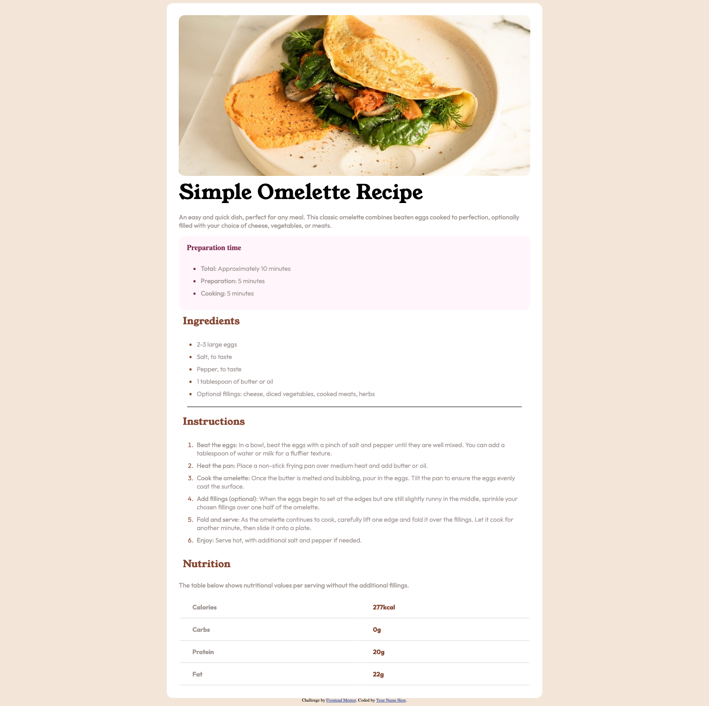

# Frontend Mentor - Recipe page solution

This is a solution to the [Recipe page challenge on Frontend Mentor](https://www.frontendmentor.io/challenges/recipe-page-KiTsR8QQKm). Frontend Mentor challenges help you improve your coding skills by building realistic projects. 

## Table of contents

- [Overview](#overview)
  - [The challenge](#the-challenge)
  - [Screenshot](#screenshot)
  - [Links](#links)
- [My process](#my-process)
  - [Built with](#built-with)
  - [What I learned](#what-i-learned)
  - [Continued development](#continued-development)
- [Author](#author)

## Overview
This is a solution to the [Recipe page challenge on Frontend Mentor](https://www.frontendmentor.io/challenges/recipe-page-KiTsR8QQKm).

This was done with HTML5 and CSS over the space of a few hours and I'm really happy with how it turned out as my first challenge.

### Screenshot

### Links

- Solution URL: [Add solution URL here](https://your-solution-url.com)
- Live Site URL: [Add live site URL here](https://your-live-site-url.com)

## My process
Firstly I reviewed the design and noted down how many div's I would need and how to break up the design to tackle it piece by piece.

Once I was comfortable with how many div's I would need I began writing the HTML needed and then once I had each Div setup I would add the css styling needed to match the design.
### Built with

- Semantic HTML5 markup
- CSS custom properties

### What I learned

I learned how to change the color of <li> items via CSS by using the code sample below :

li::marker{
    color: ;
}

### Continued development

After this challenge it's clear to me that I still have alot to learn when it comes to CSS and how to style things properly to match the design.

## Author

Ross Kennedy